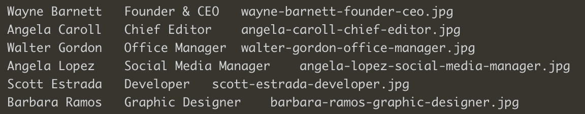

# Our Team

Utilizzando i dati forniti, creare un array di oggetti per rappresentare i membri del team. Ogni membro è caratterizzato dalle seguenti informazioni: nome, ruolo e foto.

MILESTONE 0:
- Creare l’array di oggetti con le informazioni fornite.

MILESTONE 1:
- Stampare su console, per ogni membro del team, le informazioni membro, ruolo e image;

MILESTONE 2:
- Stampare le stesse informazioni su DOM sottoforma di stringhe

BONUS 1:
- Trasformare la stringa foto in una immagine effettiva

BONUS 2:
- Organizzare i singoli membri in card/schede come immagine qui sotto:

✨ 20_11_2023